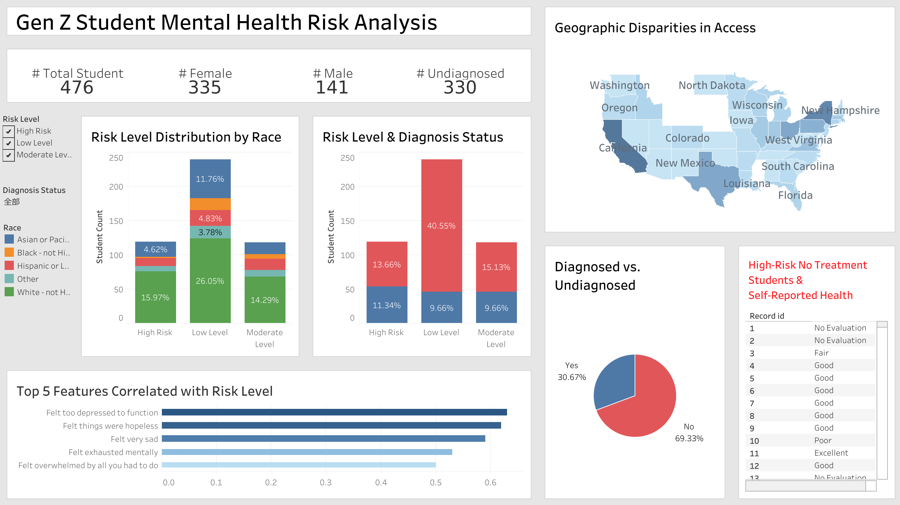
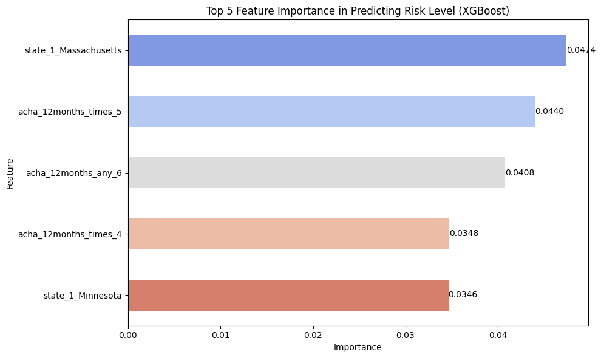
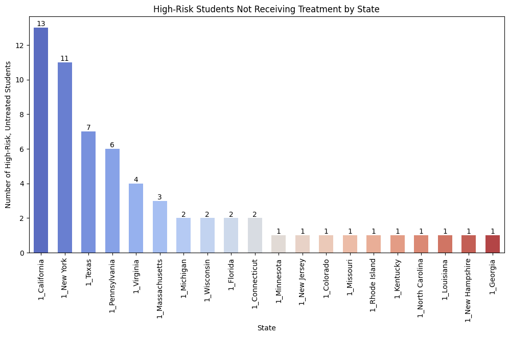
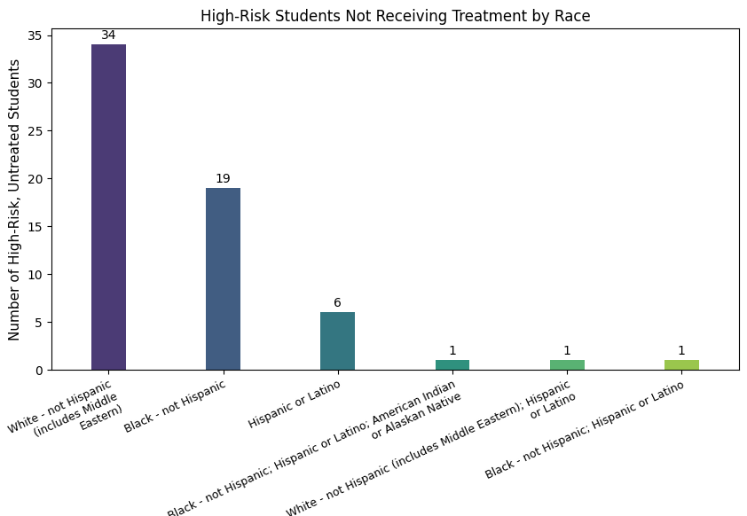

# mental-health-analysis
Student Mental Health Risk Analysis Project (DSC510)

# Mental Health Risk Analysis for University Students

This project analyzes mental health risk among Gen Z university students using survey data, with the goal of identifying undiagnosed high-risk individuals and improving access to treatment through data-driven insights and interventions.

**Notebook Link:** [View Colab Notebook](https://colab.research.google.com/drive/10wVluxZqSf1MykJIWLeTFFjXNPTkvgoc?usp=drive_link)

**Dashboard Link:** [View Tableau Dashboard](https://public.tableau.com/views/dsc510_draft/Finalized?:language=zh-TW)

## Dashboard Overview

This interactive Tableau dashboard summarizes mental health risk distribution, diagnosed vs. undiagnosed students, and high-risk subgroups by race and state.

---

## Project Overview

With the increase of depression and anxiety among younger generation, early detection is important. This project analyzes self-reported mental health survey data (PHQ-9, GAD-7, ACHA Well-being, and self reported general health) from U.S. college students to classify risk levels and recommend intervention strategies. We focused on Generation Z students (born 1997–2012) and explored treatment gaps, high-risk populations, and racial/geographic disparities.

---

## Tools & Technologies
- Excel
- Python
- Tableau Public
- Data cleaning & preprocessing
- Classification modeling
- Correlation and feature importance analysis

---

## Methodology

- Cleaned and transformed survey data (581 rows × 129 columns)
- Focused on Gen Z students
- Converted categorical variables to numerical
- Created composite scores for PHQ-9, GAD-7
- Labeled risk levels (Low / Moderate / High)
- Built classification model (XGBoost) to identify key features
- Visualized findings with Tableau dashboard

---

## Key Findings

- **69.33%** of students were undiagnosed, highlighting a gap in mental health services.
- Over **50%** of students were in the Moderate to High Risk category.
- Emotional indicators like **“Felt very sad”** and **“Felt too depressed to function”** were strong predictors of high risk.

- **Racial and state-level disparities** exist: Black students and those in urban states were overrepresented in high-risk, untreated groups.

- Many high-risk students **perceive themselves as healthy**, showing a self-awareness gap.

---

## Intervention Recommendations

Based on our findings, universities should take the following actions to bridge gaps in mental health access:

- Expand 24/7 virtual counseling options, especially in urban campuses with high-risk, untreated populations
- Provide culturally sensitive mental health programs that address racial disparities, particularly among Black students
- Promote self-screening and mental health awareness activities to help students recognize symptoms early
- Train university faculty and staff to identify warning signs and refer students to the appropriate support resources

---

## Future Work
- Expand predictive modeling by including lifestyle factors to improve early risk detection
- Integrate time-series analysis for future university dashboards to monitor mental health trends
- Develop mobile self-monitoring tools based on PHQ-9, GAD-7, and ACHA surveys to help students proactively assess their well-being
- Explore the impact of demographic features in predictive modeling to improve personalized intervention recommendations

---

## Files
- `notebooks/`: Jupyter Notebook with data cleaning and model training
- [Colab Notebook](https://colab.research.google.com/drive/10wVluxZqSf1MykJIWLeTFFjXNPTkvgoc?usp=drive_link): Contains data cleaning, PHQ-9 / GAD-7 scoring logic, risk labeling, and XGBoost modeling steps.
- [Tableau Dashboard](https://public.tableau.com/views/dsc510_draft/Finalized?:language=zh-TW): Interactive dashboard visualizing risk levels, treatment status, and demographic disparities.
- `data/`: Cleaned dataset used for modeling and dashboard visualizations, and original raw dataset downloaded from openICPSR, containing full survey responses before preprocessing
- `images/`: Key graphs and dashboard screenshots used in this README
- `Project_Report.pdf`: Final project report providing full context, literature background, methodology, key findings, and proposed interventions

